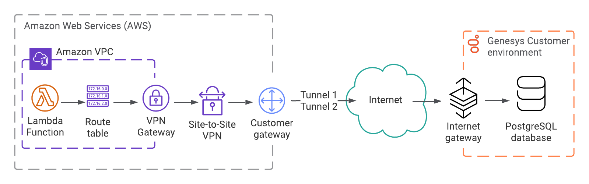

#  Access an on-premises database from an AWS Lambda

> View the full [Access an on-premises database from an AWS Lambda Blueprint article](https://developer.mypurecloud.com/blueprints/lambda-premise-blueprint/) on the Genesys Cloud Developer Center.

This Genesys Cloud Blueprint is a guide to enable your AWS resources in a virtual private cloud (VPC) to communicate with computers in your on-premises data center. You can also choose to configure your Lambda instance as a Genesys Cloud data action, as explained in [Example AWS Lambda data action with on-premises solution](https://help.mypurecloud.com/?p=209728 "Opens the Example AWS Lambda data action with on-premises solution article"). Combining these procedures enables you to build integrations with interactions entering your contact center without exposing your network.

