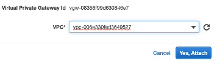

~~~
title: Access an on-premises database from an AWS Lambda
indextype: blueprint
icon: blueprint
image: images/bpPremise-Lambda.png
category: 6
summary: |
  This Genesys Cloud Developer Blueprint is a guide to enable your AWS resources in a virtual private cloud (VPC) to communicate with computers in your on-premises data center. You can also choose to configure your AWS Lambda instance as a Genesys Cloud data action, as explained in [Example AWS Lambda data action with on-premises solution](https://help.mypurecloud.com/?p=209728 "Opens the Example AWS Lambda data action with on-premises solution article"). Combining these procedures enables you to build integrations with interactions entering your contact center without exposing your network.
~~~

#  Access an on-premises database from an AWS Lambda
This Genesys Cloud Developer Blueprint is a guide to enable your AWS resources in a virtual private cloud (VPC) to communicate with computers in your on-premises data center. You can also choose to configure your AWS Lambda instance as a Genesys Cloud data action, as explained in [Example AWS Lambda data action with on-premises solution](https://help.mypurecloud.com/?p=209728 "Opens the Example AWS Lambda data action with on-premises solution article"). Combining these procedures enables you to build integrations with interactions entering your contact center without exposing your network.


* [Solution components](#solution-components "Goes to the Solution components section")
* [Prerequisites](#prerequisites "Goes to the Prerequisites section")
* [Implementation steps](#implementation-steps "Goes to the Implementation steps section")
* [Additional resources](#additional-resources "Goes to the Additional resources section")

#### Solution components

* **Genesys Cloud** - A suite of Genesys cloud services for enterprise-grade communications, collaboration, and contact center management.
* **AWS Virtual Private Cloud** - Provides a private internally managed network in your AWS cloud.
* **AWS IAM** - Identity and Access Management that controls access to AWS resources such as services or features.
* **AWS Lambda** - Serverless computing service for running code without creating or maintaining the underlying infrastructure. This Blueprint enables you to access on-premises resources from AWS Lambda running in a VPC.
* **Network Gateways** - A network node used in telecommunications that connects two networks with different transmission protocols together. This blueprint uses IPSec/strongSwan, which is an open source IPsec implementation.
* **PostgreSQL** - An open source object-relational database system.  
* **Data Actions** - Either static (preconfigured) actions or custom actions that you create to leverage the Genesys Platform API. Use these data actions to make routing decisions within your interaction flow in Architect, to present information to your agents in Scripts, or to act on data in other ways.

To learn more the various technologies referred to in the blueprint, see [Additional resources](#additional-resources "Opens the Additional resources section").

## Prerequisites

### Specialized knowledge

* Administrator-level knowledge of Genesys Cloud.
* Experience with networking and network gateways.
* (Optional) Understanding of Genesys Cloud data actions.
* AWS Cloud Practitioner-level knowledge of AWS CloudFormation, AWS IAM, and AWS Lambda.

### System requirements
* An Ubuntu or other strongSwan/IPSec compatible Linux server inside your network to act as a network gateway. The hardware requirements for this server vary with load.

  >**Tip:** As an alternative to the Linux server, you can use a virtual machine with a bridge adapter but that configuration is not covered in this blueprint.

* A PostgreSQL server located in your network where you can run networking commands.

### Genesys Cloud account

* Genesys Cloud license. For more information, see [Genesys Cloud Pricing](https://www.genesys.com/pricing "Opens the Genesys Cloud pricing page").
* (Recommended) The role of Master Admin. For more information, see the [Roles and permissions overview](https://help.mypurecloud.com/?p=24360 "Opens the Roles and permissions overview article").

### Security and resiliency considerations

#### Layer 4 security and firewalls
IPsec is configured to control which computers can communicate and how to resolve their IP addresses.
* In a production application, you should add port-level restrictions, which are outside the scope of this blueprint. The AWS Lambda security group as configured in this blueprint does not include any port restrictions.
* Genesys recommends that you configure iptables on your local gateway and limit the ports they forward to. For a tutorial on setting up iptables, see [The Beginner's Guide to iptables, the Linux Firewall](https://www.howtogeek.com/177621/the-beginners-guide-to-iptables-the-linux-firewall/ "Opens The Beginner's Guide to iptables, the Linux Firewall page").

#### Limitations
AWS site-to-site VPN does not support the following:
* IPv6 traffic
* Path MTU Discovery

#### Resiliency
If you find that IPSec sessions on your local gateway periodically collapse, consider automatically restarting IPSec whenever your VPC becomes unreachable. For example, you can add an EC2 instance in your VPC that you allow to be pinged. Then, run a script similar to the following on your local gateway:
```
	#!/bin/bash
	while :
	do
		ping -c 1 -W 1 10.2.0.25 || service ipsec restart
	done
```
This script continually pings the EC2 instance in the VPC and when it detects it to be unreachable or it fails to respond, the script restarts IPSec on the local gateway.

>**Tip:**
If you configure your local modem to forward 500/UDP and 50/TCP to your local gateway, Amazon does not intermittently destroy the VPN connection.

## Implementation steps

* [Create or repurpose a VPC where the AWS Lambda can run](#create-or-repurpose-a-VPC-where-the-AWS-Lambda-can-run "Opens the Create or repurpose a VPC where the AWS Lambda can run section")
* [Build a bridge between your on-premises network and your VPC](#build-a-bridge-between-your-on-premises-network-and-your-VPC "Opens the Build a bridge between your on-premises network and your VPC section")
* [Install and configure IPSec/Strongswan in your on-premises network](#install-and-configure-IPSec/Strongswan-in-your-on-premises-network "Opens the Install and configure IPSec/Strongswan in your on-premises network section")
* [Configure your database to use your new local gateway](#configure-your-database-to-use-your-new-local-gateway "Opens the Configure your database to use your new local gateway section")
* [Configure and test your AWS Lambda instance](#configure-and-test-your-AWS-Lambda-instance "Opens the Configure and test your AWS Lambda instance section")

### Create or repurpose a VPC where the AWS Lambda can run
To achieve the highest level of security and privacy, you create an AWS Lambda instance in a virtual private cloud (VPC), an internal network in the cloud. Computers with the necessary security group permissions can communicate freely within the VPC.

After creating the VPC, you create a subnet, which serves as a network segment where connections between computers are resolved without going through the network gateway.

#### Create a VPC

To create the VPC, do the following steps:
1. Open the AWS console and select **Services**.
2. Type "VPC" into the search box and then select **VPC** from the list that opens.
3. Select **Your VPCs** from the navigation pane on the left side of the window.
4. Click **Create VPC**.
5. Enter a name for the VPC in the **Name tag** field, such as "BridgedVPC".
6. Enter "10.2.0.0/24" or a CIDR block of your choosing in the **IPv4 CIDR block** field. This value is the VPC_CIDR_BLOCK. Keep a record of this value to use in the next procedure, to create a subnet.

  >**Tip:** If you plan on having multiple subnets, enter a higher subnet mask.

7. Select **No IPv6 CIDR block**. IPv6 is not supported for site-to-site connections.
8. Select "Default" from the **Tenancy** menu.
9. Click **Create** and then **Close**.  

  

#### Create a subnet for your VPC

To create the subnet for your new VPC, do the following steps:

1. In the AWS Console, select **Your VPCs** and then select **Subnets** from the navigation pane on the left side of the window.
2. Click **Create subnet**.
3. In the **Name tag** field, enter a name for your subnet, such as "BridgedSubnet".
4. In the **VPC** field, select the name of your new VPC from the previous procedure.
5. In the **IPv4 CIDR block**, enter the VPC_CIDR_BLOCK value you specified when configuring your VPC.
6. Click **Create** and then **Close**.  

  

### Build a bridge between your on-premises network and your VPC

The bridge consists of a customer gateway, a virtual private gateway (VPG), and a site-to-site virtual private network (VPN) connection. This section contains the procedures to create each of these three items, followed by the procedures to configure your routing table to point to your VPG and to download your VPN connection configuration file.

#### Create a customer gateway

The customer gateway is primarily a path from the internet to your home network. To create a customer gateway, do the following steps:

1. In the AWS Console, select **Customer Gateways**.
2. Click **Create Customer Gateway**.
3. In the **Name** field, enter a name, such as "BridgedCustomerGateway".
4. In the **Routing** field, select "Static".
5. In the **IP Address** field, enter the public facing IPv4 address for your network. To locate this address, browse to https://whatismyipaddress.com/ from inside your network.

  >**Tip** For the purpose of this tutorial, you need to enter only the public-facing ID for your home network.

6. Click **Create Customer Gateway** and then **Close**.

  

#### Create a virtual private gateway

The virtual private gateway (VPG) is a path for entities in your VPC to reach addresses outside of the VPC.
1. From the left-side navigation pane in the Amazon Console, click **Virtual Private Gateways**.
2. Click the **Create Virtual Private Gateway**, button, located near the top of the Virtual Private Gateways window.
3. In the **Name** field, enter a name for your VPG, such as "BridgedVPG".
4. Click **Create Virtual Private Gateway** and then **Close**.

  

Attach the VPG to your VPC:
1. Select the VPG you created in the previous step from the list of VPGs.
2. From the **Actions** menu, select **Attach to VPC**.
3. From the **VPC** menu, select your new VPG.
4. Click **Yes, Attach**.

  

#### Create a site-to-site VPN

The site-to-site VPN connects your VPG and your customer gateway. This is where you configure and monitor your tunnels.
1. From the left-side navigation pane in the Amazon Console, click **Site-to-Site VPN Connections**.
2. Click the **Create VPN Connection** button located near the top of the Site-to-Site VPN Connections window.
3. In the **Name tag** field, enter a name for your connection, such as "BridgedVPNConnection".
4. Select **Virtual Private Gateway** as the **Target Gateway Type**.
5. Select your new VPG from the **Virtual Private Gateway** menu.
6. Select **Existing”** in the **Customer Gateway** field.
7. From the **Customer Gateway ID** menu, choose the customer gateway you created in the **Create a customer gateway** procedure, above.
8. Select **Static** in the **Routing Options** field.
9. In the **IP Prefixes** column in the table that appears, enter the VPC_CIDR_BLOCK value you previously specified in the **Create a VPC** procedure, above.

  

10. Scroll to the bottom of the window to click **Create VPN Connection** and then **Close**.

  It takes a few minutes for the connection to go from "pending" to "available". To update the status of the items in the window, click the **Refresh** button in the upper right corner.

  

  and after a few minutes

  

11. After the connection is available, select the check box next to your VPN Connection. Note the following pieces of information:

* The **Tunnel Details** tab, which appears at the bottom of the window. It shows two tunnels, both in the DOWN (inoperable) status.
* The "Outside IP Address" values for your tunnels. These are the IPs for your VPN Connection, which users can access from the internet.

#### Configure your routing table to point to your VPG

The routing table configuration points entities  in your VPC that are trying to reach computers in your on-premises subnet to your VPG.
1. From the left-side navigation pane in the Amazon Console, click **Route Tables**.
2. In the Search box, enter the name of your VPC and press **Enter**.
3. Select the routing table to edit, and then click the **Tags** tab.
4. Click **Add/Edit Tags**.
5. Click **Create Tag**.
6. In the **Key** column, enter "Name".
7. In the “**Value** column, enter a name for your routing table, such as BridgedRoutingTable, and then click **Save**.

  

Next, add your VPG as the destination in your new routing table.
1. Click the **Routes** tab and then click **Edit routes**.
2. Click **Add route**.
3. Enter your on-premises network’s subnet and mask in the **Destination** column.
4. From the **Target** menu, scroll to and select "Virtual Private Gateway" and then select the VPG you created in the "Create a virtual private gateway" procedure, above.
5. Click **Save routes** and then **Close**.

  

#### Download your VPN connection configuration file

The VPN configuration file is used to set up IPSec/Strongswan on your local gateway. It contains specific IP addresses and pre-shared keys (similar to passwords) for connecting to your site-to-site VPN.

>**Warning!** For security, protect this file and its contents. Do not share or publish it.

To configure the VPN connection, do the following steps:
1. From the left-side navigation pane in the Amazon Console, click **Site-to-Site VPN Connections**.
2.	Select your VPN.
3.	Click **Download Configuration**, which is located at the top of the window.
4.	From the **Vendor** menu, select **Generic**.
5.	Click **Download**. Your browser saves a file with a name similar to "vpn-XXXXXXXXXXXXXX.txt". this file contains the configuration necessary to connect to your tunnels.

### Install and configure IPSec/Strongswan in your on-premises network

strongSwan is a multi-platform IPsec implementation.
* For more information about strongSwan, see https://wiki.strongswan.org/projects/strongswan/wiki/IntroductionTostrongSwan.
* To download strongSwan, navigate to https://www.strongswan.org/download.html.
* For complete installation instructions, see https://wiki.strongswan.org/projects/strongswan/wiki/InstallationDocumentation.

After you install strongSwan, do the following steps to configure it:

1. Locate and open the **/etc/ipsec.conf** file.
2. Add the following line to the end of the file:

  ```
include /etc/ipsec.d/<your_vpn_name>.conf
```

3. Update the **/etc/ipsec.secrets** file.
  a. Open the configuration file (vpn-XXXXXXXXXXXXXX.txt) you downloaded from AWS.
  b. Copy the **Pre-Shared Key** and **Virtual Private Gateway** values for each tunnel into the **ipsec.secrets** file in the following format:

  ```
  52.73.255.8 : PSK "tS11pZ8haqpMnlgqhfBpDwh1K0aqJ4lv"
  54.165.167.252 : PSK "LYU0JGK_V4kgBOXDGyKS8h1r2qKuBzyv"
```

4. Update the **/etc/sysctl.conf** file by adding the following lines:

  ```
net.ipv4.ip_forward = 1
net.ipv4.conf.all.send_redirects = 0
net.ipv4.conf.default.send_redirects = 0
net.ipv4.tcp_max_syn_backlog = 1280
net.ipv4.icmp_echo_ignore_broadcasts = 1
net.ipv4.conf.all.accept_source_route = 0
net.ipv4.conf.all.accept_redirects = 0
net.ipv4.conf.all.secure_redirects = 0
net.ipv4.conf.all.log_martians = 1
net.ipv4.conf.default.accept_source_route = 0
net.ipv4.conf.default.accept_redirects = 0
net.ipv4.conf.default.secure_redirects = 0
net.ipv4.icmp_echo_ignore_broadcasts = 1
net.ipv4.icmp_ignore_bogus_error_responses = 1
net.ipv4.tcp_syncookies = 1
net.ipv4.conf.all.rp_filter = 1
net.ipv4.conf.default.rp_filter = 1
net.ipv4.tcp_mtu_probing = 1
```

5. Create a connection file named **/etc/ipsec.d/your_vpn_name.conf** with the following content:

  ```
conn vpc
mobike=no
type=tunnel
compress=no
keyexchange=ikev2
ike=aes128-sha1-modp1024
ikelifetime=28800s
esp=aes128-sha1-modp1024
lifetime=3600s
rekeymargin=3m
keyingtries=3
dpddelay=10s
dpdtimeout=30s
dpdaction=restart
authby=psk
leftsubnet=10.0.0.0/24   # Internal Network CIDR block
auto=start
```
```
conn tunnel1
also=vpc
right= 3.226.212.127   # Public Ip Address of Tunnel #1
rightsubnet=10.2.0.0/24   # VPC Network CIDR block
```
```
conn tunnel2
also=vpc
right=34.237.108.153   # Public Ip Address of Tunnel #2
rightsubnet=10.2.0.0/24   # VPC Network CIDR block
```

6. Restart your local gateway by entering the following:

  ```
$ reboot
```

To verify that your tunnels are in the **UP** status, do the following steps:

  1. From left-side navigation pane in the Amazon Console, click **Site-to-Site VPN**.
  2. Click **Select your VPN Connection**.
  3. Click the **Tunnel Details Tab** from the lower section of the window.
  4. Verify that both of your tunnels show their status as **UP**.

  

### Configure your database to use your new local gateway
In order for the computers in your network to be able to send messages to addresses in your VPC they will need to be configured to route traffic in that CIDR block through your Local Gateway.

To add the local gateway to the servers you want to access from your VPC, do the following steps:

1. SSH (or an equivalent) into those servers.
2. Run the command shown below that is appropriate for your operating system.

>**Tip:** In the examples below “10.2.0.0” is the subnet, 255.255.255.0 is the subnet mask (corresponding to "/24", shown elsewhere in this Blueprint), and 10.0.0.11 is the IP of the local gateway.

Windows:
```
 > route add 10.2.0.0 MASK 255.255.255.0 10.0.0.11
```
Linux:
```
 $ sudo route add -net 10.2.0.0 netmask 255.255.255.0 gw 10.0.0.11
```
OSX:
```
 $ sudo route -n add 10.2.0.0/24 10.0.0.11
```
### Configure and test your AWS Lambda instance
Use the following series of procedures to create and test your AWS Lambda for use with your new network setup.

#### Create a policy for your AWS Lambda
The policy for your AWS Lambda instance permits it to create and manage network interfaces. To set the policy, do the following steps:

1. From the top of the AWS Console, click **Services**.
2.	In the Search box, enter "IAM", and then select **IAM** when it appears.
3.	From the left-side menu pane, click **Policies**.
4.	From the top of the window that opens, lick **Create policy**.
5.	Click the **JSON** tab.
6.	Enter the following JSON code:
```
{
    "Version": "2012-10-17",
    "Statement": [
        {
            "Effect": "Allow",
            "Action": [
                "ec2:CreateNetworkInterface",
                "ec2:DetachNetworkInterface",
                "ec2:DescribeNetworkInterfaces",
                "ec2:DeleteNetworkInterface",
                "ec2:AttachNetworkInterface"
            ],
            "Resource": "*"
        }
    ]
}
```
7.	From the bottom of the window, click **Review Policy**.
8.	In the **Name** field, enter a name for the policy, such as "BridgedVPCLambdaPolicy".
9.	From the bottom of the screen, click **Create Policy**.

####	Create a role for your AWS Lambda to use incorporating the new policy

The role gives your AWS Lambda instance permission to create an Elastic Network Interface, which is required to use your AWS Lambda in the VPC you are using to access your on-premises network.

1.	From the left-side menu pane in the AWS Console, click **Roles** and then click **Create Role**.
2.	Select the **AWS service** check box.
3.	Under **Common use cases**, select **Lambda**.
4.	From the bottom of the window, click **Next: Permissions**.
5.	In the **Search** field, enter the name of the policy you created in the previous procedure.
6.	Select the check box next to the policy name, and then enter "AWSLambdaBasicExecutionRole" in the **Search** field.
7.	Select the check box next to **AWSLambdaBasicExecutionRole**.
8.	From the bottom of the window, click **Next: Tags** and then **Next: Review**.
9.	In the **Name** field, enter a name for this role, such as "BridgedVPCLambdaRole".

#### Create an AWS Lambda package
To create your AWS Lambda instance, open a terminal window and do the following steps:

1. Use the following commands to clone the Genesys Cloud Git repo containing the file for AWS Lambda instance that calls out to a Postgres server in an on-premises network:

  ```
$ git clone git@github.com:MyPureCloud/premise-postgres-lambda-example.git
```
```
$ cd ./premise-lambda-example
```

2. Install the dependencies using the following command:

  ```
$ npm install
```
3. Build the AWS Lambda package. This build command creates a **lambda.zip** file containing the source code in the current working directory. You upload this file at later point in the process of deploying your AWS Lambda instance.

  ```
$ npm build
```

#### Create the AWS Lambda in AWS

1.	From the top of the AWS Console, click **Services**.
2. 	In the **Search** field, Enter "Lambda", and click **Lambda** when it appears.
3.	Click **Create Function**.
4.	In the **Function name** field, enter a name for your AWS Lambda, such as "BridgedVPCLambda".
5.	Click **Choose or create an execution role**.
6.	In the **Execution role** field, select **Use an existing role**.
7.	In the **Existing role** field, enter the name of the AWS Lambda role you created earlier in this series of procedures.
8. Click **Create function**.

  

9. On the **Function code** pane of the window that appears, select **Upload a .zip file** from the **Code entry type** dropdown.
10.	Click **Upload**.
11.	Navigate to and select the **lambda.zip** file you created in the previous "Create an AWS Lambda package" procedure.
12.	Click **Open**.

#### Set AWS Lambda environment variables
The AWS Lambda environment variables are accessible in the node runtime.

>**Tip:** Encrypting sensitive data (like the password) is not covered in this tutorial. For more information is available, see [Using AWS Lambda environment variables](https://docs.aws.amazon.com/lambda/latest/dg/configuration-envvars.html "Opens the Using AWS Lambda environment variables page").

1.	Open the AWS Lambda console **Functions** page.
2. Choose the function you created previously in this series of procedures.
3. Under **Environment variables**, click **Edit**.
4. Click **Add environment variable**.
5. Create the following environment variables substituting the values for your Postgres server as appropriate:

  

6.	Click **Save**.

####	Configure the AWS Lambda to start in your VPC
The AWS Lambda needs to be configured to start up in the VPC bridged to your local gateway.
1.	In the **VPC** section, click **Edit**.
2.	Select **Custom VPC**.
3.	In the **VPC** menu, enter and select the name you gave your VPC.
4.	In the **Subnets** menu, enter and select the subnet you configured to use with this VPC.

  >**Note:** A warning appears stating that AWS recommends at least two subnets for AWS Lambdas. Setting up redundant subnets is beyond the scope of this tutorial.  

5.	In the **Security groups** menu, select **default**.
6.	Click **Save**.

#### Test your AWS Lambda
To test your AWS Lambda, you will configure an existing PostgreSQL database and verify that the AWS Lambda can make changes to it. To set up the database and run tests, do the following steps:

1.	If you do not have a PostgreSQL database installed, download and set one up from https://www.postgresql.org/.
2. In your PostgreSQL database, run the following command to create the table that the AWS Lambda depends on:
```
CREATE TABLE call_counters ( phone_number VARCHAR PRIMARY KEY, call_count INTEGER )
```
3.	To run your AWS Lambda, click **Lambda** from the AWS Console and then click **Configure test events**.
4.	Select **Create new test event**.
5.	In the **Event name** field, enter a name for the test, such as "TestBridgedLambda".
6.	In the code window, enter the following JSON code:
```
{
  “phoneNumber”: “777-777-777”
}
```
7.	Click **Create**.
8.	from the top of the window, click **Test**.
9.	In the **Execution result** section, click **Details**.

  

Congratulations! Your AWS Lambda is able to read and update your database in your on-premises network.

>**Tip:** The procedures in this blueprint require only minimal changes to connect any network having a public IP with your AWS VPC. For example, you can use essentially the same procedures to create a region-to-region VPN connection.

##### (Optional) Integrate Genesys Cloud data actions
Now that your VPC is connected with your local on-premises network, you can integrate with your Genesys Cloud data actions. This enables you to transmit data from your data center into your IVR flows without exposing ports to the internet. This tutorial explains how to integrate data actions with your AWS Lambda: [Data actions with on-premises solutions overview](https://help.mypurecloud.com/articles/?p=209698 "Opens the Data actions with on-premises solutions overview article").

## Additional resources

* [What is AWS Site-to-Site VPN?](https://docs.aws.amazon.com/vpn/latest/s2svpn/VPC_VPN.html "Opens the What is AWS Site-to-Site VPN? page")
* [Virtual private gateway associations](https://docs.aws.amazon.com/directconnect/latest/UserGuide/virtualgateways.html "Opens the Virtual private gateway associations page")
* [AWS Lambda Documentation](https://docs.aws.amazon.com/lambda/?id=docs_gateway "Opens the AWS Lambda Documentation page")
* [Using AWS Lambda environment variables](https://docs.aws.amazon.com/lambda/latest/dg/configuration-envvars.html "Opens the Using AWS Lambda environment variables page")
* [strongSwan - documentation](https://www.strongswan.org/documentation.html "Opens the strongSwan - documentation page")
* [The Beginner’s Guide to iptables, the Linux Firewall](https://www.howtogeek.com/177621/the-beginners-guide-to-iptables-the-linux-firewall/ "Opens the Beginner’s Guide to iptables, the Linux Firewall page")
* [About the Genesys Cloud data actions integration](https://help.mypurecloud.com/articles/?p=144553 "Opens the About the Genesys Cloud data actions integration article")
* [PostgreSQL Documentation](https://www.postgresql.org/docs/ "Opens the PostgreSQL Documentation page")
